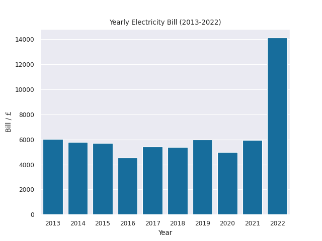

# solar-panel-feasibility
Repository for analysis and discussion on the feasibility of solar panels.

## How much does the church spend on electricity per year?

Yearly electricity bills for years 2013-2022 are plotted below:



Recent fluctuations in electricity prices are evident. (Note for transparency: I didn't have the financial report for 2017, so it is presented as the average of the four years on either side.)

## What do we assume for our calculations?

At present we use quite rough estimates. If anyone sees a figure they disagree with, reach out and we can update it. We can get a better idea of what to expect if we consult a provider. The figures used in the projections are shown below:

```
installation_cost: 10000    # £ including battery storage and maintenance
expected_unit_rate: 0.2802  # PowerNI current rate for quarterly bill, £/kWh
sell_back_rate: 0.15       # £ / kWh
yearly_bill: 14126.03       # £, figure for 2022 to match inflated unit rate.
ave_hours_daylight: 4       # hours / day
solar_panel_total_output: 4 # kW
solar_panel_lifetime: 25    # years
```

## Where can I see the calculations?

All working out is shown in [this notebook](notebooks/rough_projections.ipynb). Figures for payback intervals and total profit are shown there for a few different scenarios. I've included some further discussion there, and have tried to make everything as clear as possible, but let me know if something doesn't make sense or seems incorrect. 

## What can we conclude?

Based on this rough analysis, it does seem that solar panels will pay for themselves during their lifetime. There is high uncertainty regarding when exactly this will occur, and this depends both on how the church uses the electricity the solar panels generate, as well as on electricity prices. I believe it's fair to assume that electricity rates will not stay at their current elevated rates indefinitely, so I think a payback interval of somewhere between 11-20 years is reasonable, however this is still a wide range.

In terms of a financial decision, solar panels represent a sizeable investment. Even assuming that the solar panels pay for themselves eventually, we'd have to collectively weigh up the benefits of the savings offered versus using the money for different purposes, including ones which would not yield monetary reward, but which would advance God's Kingdom more than a reduced carbon footprint.